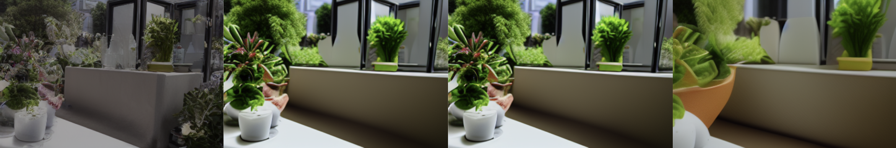
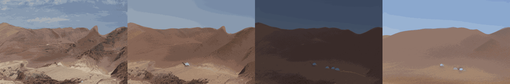
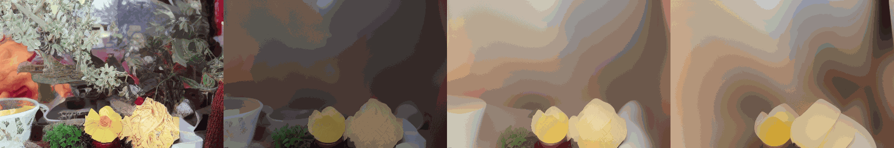
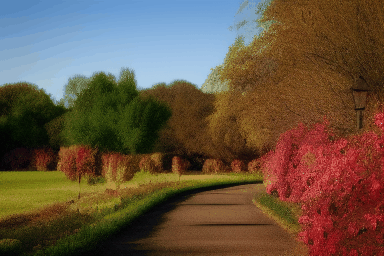
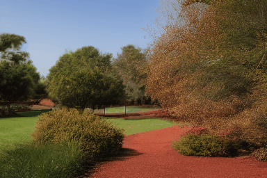
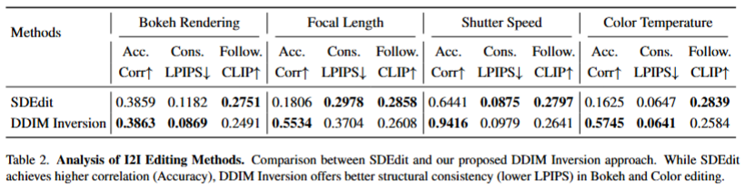
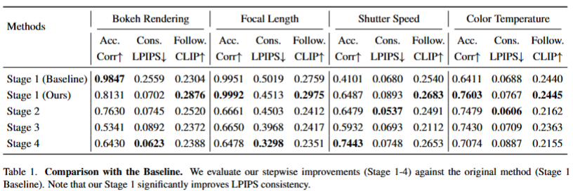

# generative-photography

This project is derived from [[CVPR 2025 Highlight] Generative Photography](https://arxiv.org/abs/2412.02168).

> **Generative Photography: Scene-Consistent Camera Control for Realistic Text-to-Image Synthesis** <br>
> [Yu Yuan](https://yuyuan-space.github.io/), [Xijun Wang](https://www.linkedin.com/in/xijun-wang-747475208/), [Yichen Sheng](https://shengcn.github.io/), [Prateek Chennuri](https://www.linkedin.com/in/prateek-chennuri-3a25a8171/), [Xingguang Zhang](https://xg416.github.io/), [Stanley Chan](https://engineering.purdue.edu/ChanGroup/stanleychan.html)<br>

The original github page is https://github.com/pandayuanyu/generative-photography

## [[Paper](https://arxiv.org/abs/2412.02168)] [[Project Page](https://yuyuan-space.github.io/GenerativePhotography/)] [[Dataset](https://huggingface.co/datasets/pandaphd/camera_settings)] [[Weights](https://huggingface.co/pandaphd/generative_photography)] [[HF Demo](https://huggingface.co/spaces/pandaphd/generative_photography)]






## Configurations

### 1. Environment
*   CUDA 12.1, 64-bit Python 3.10 and PyTorch 2.1.1
*   Other environments may also work, at least for PyTorch 1.13.1 and CUDA 11.7
*   Users can use the following commands to install the packages
```bash
conda env create -f environment.yaml
conda activate genphoto
```

### 2. Prepare Models, Weights and Datasets
*   Install git-lfs first
```bash
sudo apt install git-lfs -y
```
*   Under I2I-generative-photography - Download models and weights
```bash
GIT_LFS_SKIP_SMUDGE=1 git clone https://huggingface.co/pandaphd/generative_photography
cd generative_photography
git lfs install
git lfs pull
cd ..
rm -rf models/stable-diffusion-v1-5 models/weights
mv generative_photography/* models/
rm -rf generative_photography
```
*   Under I2I-generative-photography - Download dataset
```bash
GIT_LFS_SKIP_SMUDGE=1 git clone https://huggingface.co/datasets/pandaphd/camera_settings
cd camera_settings
git lfs install
git lfs pull
```

## Inference

### Inference All In One
* You can inference your own gif.
* The input order of camera setting will decide the order of genertation
```python
# inference one
python inference.py   \
        --prompt "A blue sky with mountains."   \
        --color "[5455.0, 5155.0, 5555.0, 6555.0, 7555.0]" \
        --bokehK "[2.44, 8.3, 10.1, 17.2, 24.0]" \
        --shutter "[0.1, 0.3, 0.52, 0.7, 0.8]" \
        --focal "[25.0, 35.0, 45.0, 55.0, 65.0]" \
        --output_dir "inference_output" \
        --seed 42

# inference two
python inference.py   \
    --prompt "A variety of potted plants are displayed on a windowsill, \
        with some of them placed in yellow and white bowls. The plants \
        are arranged in a visually appealing manner, creating a pleasant atmosphere in the room."   \
    --bokehK "[2.44, 8.3, 10.1, 17.2, 24.0]" \
    --shutter "[0.1, 0.3, 0.52, 0.7, 0.8]" \
    --color "[5455.0, 5155.0, 5555.0, 6555.0, 7555.0]" \
    --focal "[25.0, 35.0, 45.0, 55.0, 65.0]" \
    --output_dir "inference_output" \
    --seed 42
```

### I2I Method Comparison

*   Using I2I method (**DDIM inversion** & **SDEdit**) to inference multiple camera settings
*   Input Image
  


*   Inference by DDIM inversion & SDEdit automatically
```bash
chmod +x run_ablation_3params.sh
./run_ablation_3params.sh
```

*   Result of DDIM Inversion



*   Result of SDEdit



### Multiple Stages

*   Use the validation set from the author to sample multiple camera settings
*   We divide it to 4 stages. In each stage, we add a new camera setting to the image

```bash
chmod +x run_experiment_runner.sh
./run_experiment_runner.sh
```

## Evaluation

*   We use Correlation Coefficient, LPIPS and CLIP to evaluate.

### I2I Method Comparison

```bash
python evaluation_code/evaluate_DDIM_SDEdit.py \
  --root_dir "outputs/ablation_3params" \
  --base_image "input_image/my_park_photo.jpg" \
  --prompt "A photo of a park with green grass and trees" \
  --output_dir "Evaluation_Results"
```

* Result


### Multiple Stages

```bash
python evaluation_code/evaluate_all.py \
  --root_dir "experiments_final" \
  --data_root "." \
  --output_dir "Evaluation_Results"
```

* Result
